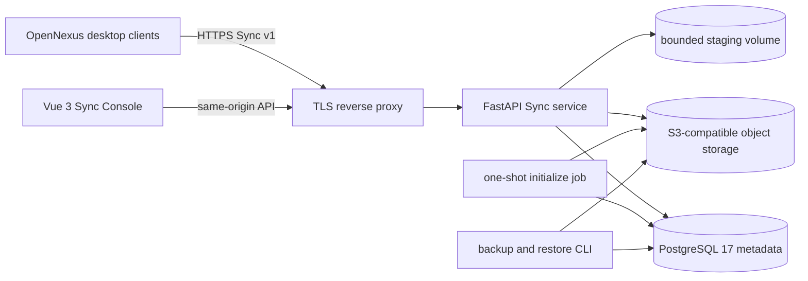
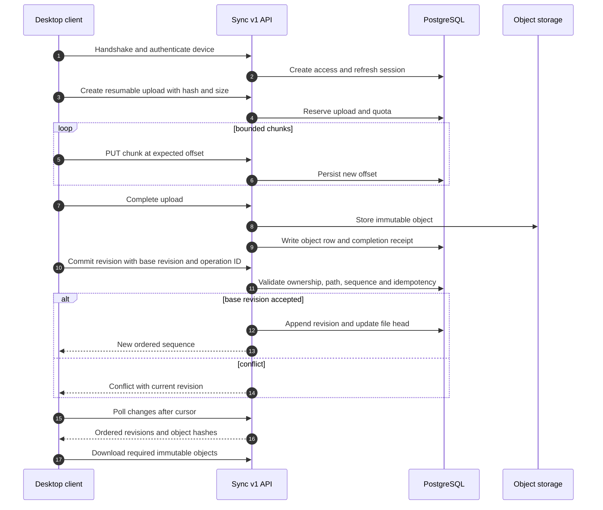
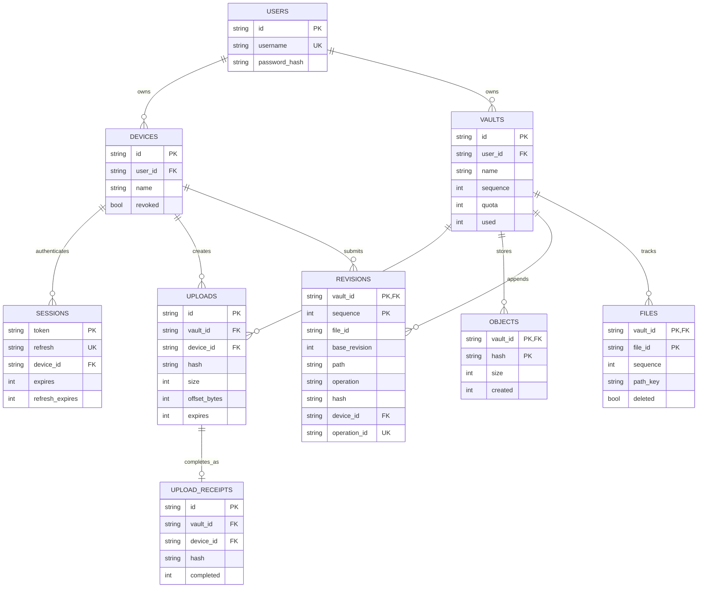
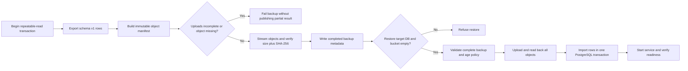

# Sync for OpenNexus

[简体中文](README.zh-CN.md) | **English**

[](https://github.com/KiriAky107/Sync-for-OpenNexus/releases/tag/v0.5.2-alpha1)


[](LICENSE)

Sync for OpenNexus is the optional self-hosted synchronization service for OpenNexus vaults. It manages accounts, devices, immutable content objects, ordered file revisions, resumable uploads, backup, and empty-instance restoration without running the desktop AI Core or reading a user's local vault directly.

> **Alpha status:** deploy behind TLS and access controls. PostgreSQL and S3-compatible object storage are the production path; SQLite and direct HTTP are limited to isolated tests.

## Capabilities and boundaries

- Access/refresh sessions and per-device revocation.
- Per-user Vault isolation, quotas, and ordered revision streams.
- Resumable chunk uploads with offset, size, SHA-256, and idempotent completion checks.
- Immutable object storage separated from PostgreSQL metadata.
- Conflict-safe base revisions consumed by the OpenNexus desktop outbox/inbox client.
- Repeatable-read backup and verified restoration into an empty deployment.
- Same-origin Vue management console for health, account, Vault, and device operations.

The server does not run models, index Markdown, install extensions, or accept OpenNexus provider credentials. It does not reuse Community tokens.

## Architecture



`compose.yaml` binds the API to `127.0.0.1:8080`, runs a one-shot idempotent initializer, drops Linux capabilities, uses a read-only service filesystem, and gives the long-running service bucket-scoped credentials instead of MinIO root credentials.

## Sync protocol flow



## Database model



The schema also contains `schema_version`, `login_limits`, and `bootstrap_state`. Object bytes live in S3; PostgreSQL remains the authority for ownership, revision ordering, quota accounting, receipts, and object inventory.

## Repository layout

| Path | Purpose |
| --- | --- |
| `sync_server/` | API, protocol, database, storage, readiness, backup, and restore |
| `console/` | Vue 3 and TypeScript management console |
| `tests/` | Protocol, production storage, readiness, console, and benchmark tests |
| `tools/` | Bounded upload and transfer probes |
| `compose.yaml` | PostgreSQL, MinIO, initializer, and hardened Sync service |
| `compose.test.yaml` | Explicit isolated-test overrides |

## Quick start

```powershell
Copy-Item .env.example .env
# Generate independent values for every blank secret, then edit .env.
docker compose up -d --build
docker compose ps
docker compose logs sync
```

The first empty database creates a temporary `admin` account and emits `SYNC_BOOTSTRAP_CREDENTIALS` to the Sync container log. Sign in once and immediately change both username and password. Until fixed, restart rotates the bootstrap password and revokes old sessions.

### Required deployment variables

| Variable | Purpose |
| --- | --- |
| `POSTGRES_PASSWORD` | PostgreSQL container password |
| `SYNC_DATABASE_URL` | URL-encoded PostgreSQL SQLAlchemy URL |
| `MINIO_ROOT_USER`, `MINIO_ROOT_PASSWORD` | Initializer-only object-store administration |
| `SYNC_ACCESS_KEY_ID`, `SYNC_SECRET_ACCESS_KEY` | Bucket-scoped runtime identity |
| `SYNC_S3_BUCKET` | Existing or initialized object bucket |
| `SYNC_BIND_ADDRESS`, `SYNC_PORT` | Host bind address and port |

Never reuse MinIO root credentials as runtime credentials. Keep the bucket name stable during upgrades.

## Health and operations

- `/health` reports process health.
- `/ready` verifies database schema, staging writes, and object-store probe operations.
- `/` and `/console/` serve the same-origin management console.
- Production traffic must terminate TLS at a reverse proxy; `Caddyfile.example` is a starting point.
- Direct exposure through `compose.test.yaml` is only for an authorized isolated demonstration environment.

## Backup and restore

```powershell
python -m sync_server backup --directory D:/OpenNexus-backups/latest --io-workers 8
python -m sync_server restore --directory D:/OpenNexus-backups/latest --io-workers 8
```



Backup directories contain authentication and session hashes. Protect them with restricted ACLs, encrypted storage, retention rules, and off-host copies. Practice restoration on a separate empty instance.

## Development and tests

```powershell
uv sync --frozen
uv run pytest

cd console
corepack enable
corepack prepare pnpm@10.28.0 --activate
pnpm install --frozen-lockfile
pnpm type-check
pnpm build
```

Tests create temporary databases, object directories, and staging directories; they must not read an OpenNexus user Vault or real deployment credentials.

## Security and community

- Do not commit `.env`, tokens, passwords, dumps, object data, backups, or user Vault content.
- Restrict database and object-store networks, enable monitoring, and revoke lost devices.
- Treat path normalization, operation IDs, base revisions, quotas, content hashes, and account boundaries as security controls.
- Report vulnerabilities according to [SECURITY.md](SECURITY.md), not in a public Issue.
- Contributions follow [CONTRIBUTING.md](CONTRIBUTING.md) and the [Code of Conduct](CODE_OF_CONDUCT.md).
- Use the repository Issue forms and Pull Request template; redact infrastructure and account details.

Related repositories: [OpenNexus](https://github.com/KiriAky107/OpenNexus) and [Community for OpenNexus](https://github.com/KiriAky107/Community-for-OpenNexus).

## License

This project is licensed under the [MIT License](LICENSE). Third-party components remain subject to their own licenses and notices.
