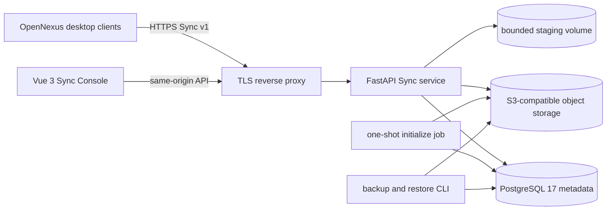
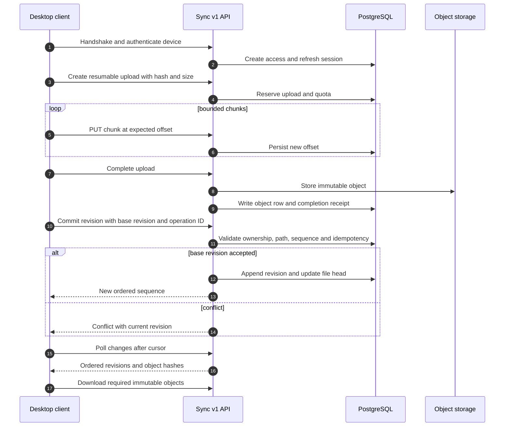
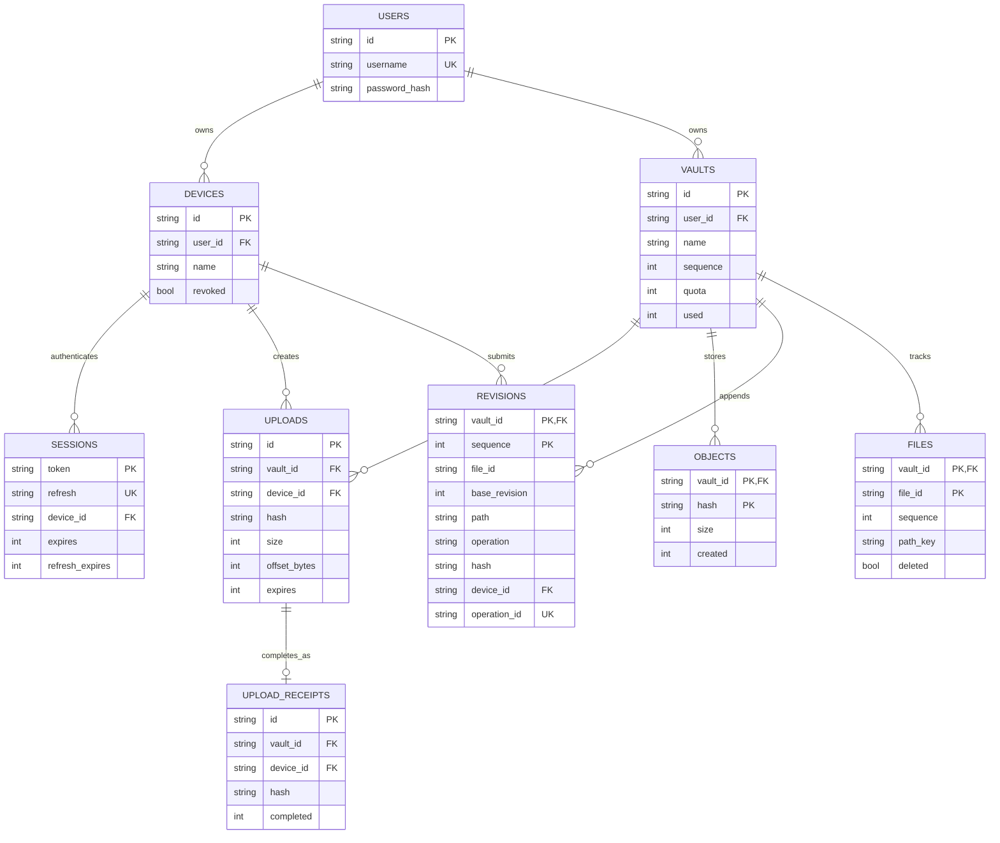
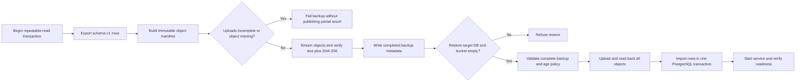

<div align="center">

  

  <h1>Sync for OpenNexus</h1>

  <p><strong>Self-hosted Synchronization for Your Knowledge Vaults</strong></p>

  <p>Keep your OpenNexus vaults in sync across devices, retain file revisions and recover data on infrastructure you control.</p>

  <p>
    <a href="README.zh-CN.md">简体中文</a> • <a href="#quick-start">Quick Start</a> • <a href="#highlights">Highlights</a> • <a href="#architecture">Architecture</a> • <a href="#development">Development</a> • <a href="https://github.com/KiriAky107/Sync-for-OpenNexus/releases">Releases</a>
  </p>

  <p>
    <a href="https://github.com/KiriAky107/Sync-for-OpenNexus/releases/tag/v0.6.0"></a> <a href="https://github.com/KiriAky107/Sync-for-OpenNexus/actions/workflows/ci.yml"></a>      <a href="LICENSE"></a>
  </p>

</div>

---

Current release: [v0.6.0](https://github.com/KiriAky107/Sync-for-OpenNexus/releases/tag/v0.6.0).

Current development adds account-scoped storage accounting, upload management and reviewed object reclamation. Usage separates current unique objects, objects retained only by history, unreferenced objects and active upload reservations, with a server confirmation time. History remains indefinitely retained.

## What’s New in 0.6.0

- Declare synchronization types and capabilities for retained experiment sources, inputs and artifacts, paired with OpenNexus 0.6.0.
- Expose devices, usage, progress and conflict receipts while retaining chunk offsets, digest verification and idempotent completion.
- The management console isolates accounts and exposes readiness and durable operation records. The CLI can inspect and reconcile unknown outcomes.
- PostgreSQL and S3 deployment includes verified backups and restoration into empty targets, checking database rows, object bytes and device revocation state.
- GitHub CI verifies the protocol, console and deployment package; releases provide fixed source, deployment archives and SHA-256 checksums.

## Highlights

- **Devices and sessions**: Connect desktop clients with access and refresh sessions, then revoke a lost device from the console.
- **Portable vault files**: Transfer notes, attachments, experiment sources and inputs through stable file identities and canonical relative paths.
- **Resumable uploads**: Continue from confirmed chunk offsets and verify the completed object's size and SHA-256 before committing a revision.
- **Retained history**: Keep ordered revisions and immutable objects. Base-revision checks detect concurrent edits rather than silently replacing them.
- **Usage and isolation**: Keep each account's vaults separate and enforce quotas using the server's object inventory and upload reservations.
- **Recovery and operations**: Verify backups, restore into an empty instance and inspect durable operation records in the CLI or the same-origin Vue console.

## Quick Start

Deploy behind a TLS reverse proxy with PostgreSQL metadata and S3-compatible object storage. The Compose stack binds the API to `127.0.0.1:8080`.

```powershell
Copy-Item .env.example .env
# Generate independent values for every blank secret, then edit .env.
docker compose up -d --build
docker compose ps
docker compose logs sync
```

The first empty database creates a temporary `admin` account and emits `SYNC_BOOTSTRAP_CREDENTIALS` to the Sync container log. Sign in once and immediately change both username and password. Until fixed, restart rotates the bootstrap password and revokes old sessions.

### Required deployment variables

| Variable | Purpose |
| --- | --- |
| `POSTGRES_PASSWORD` | PostgreSQL container password |
| `SYNC_DATABASE_URL` | URL-encoded PostgreSQL SQLAlchemy URL |
| `MINIO_ROOT_USER`, `MINIO_ROOT_PASSWORD` | Initializer-only object-store administration |
| `SYNC_ACCESS_KEY_ID`, `SYNC_SECRET_ACCESS_KEY` | Bucket-scoped runtime identity |
| `SYNC_S3_BUCKET` | Existing or initialized object bucket |
| `SYNC_BIND_ADDRESS`, `SYNC_PORT` | Host bind address and port |

Never reuse MinIO root credentials as runtime credentials. Keep the bucket name stable during upgrades.

Open `/console/` through your reverse proxy to sign in, fix the initial credentials and create a remote vault. SQLite and direct HTTP fixtures are for isolated tests.

## Core Workflows

### 1. Connect and synchronize a vault

1. Sign in to the console and create a remote vault. Keep its identity when configuring other devices.
2. Configure the Sync server, account and remote vault in OpenNexus. Each device uses its own session; provider credentials are unrelated to Sync credentials.
3. Synchronize, inspect progress and review any conflict before choosing the content to keep. Renames retain file identity; the server never executes uploaded files.

### 2. Review and restore a file

1. Open **Files and history** in the console, choose a vault and select a file. Search by relative path or include deleted files; paged lists keep a fixed snapshot until refreshed.
2. Select a revision to see its time, device, path and restore source. Older records without a known time remain marked unknown. Compare complete text previews and bounded line differences, or inspect a safe image preview; unsupported files retain their original size and hash for review.
3. Check the destination path and acknowledge the current content and historical source. A renamed file defaults to its current name; if a deleted file's path is occupied, choose another path. Restore creates a new revision with the same file identity.
4. If the current revision changes, refresh and review again. If the response is lost, use **Check restore result** first. Retry is offered only when no completion receipt is found and keeps the original operation ID; later edits remain intact.

### 3. Manage device access

Open the device list in the console and revoke the selected session. Its next authenticated request fails. Vault files and retained revisions remain available to other authorized devices.

### 4. Review storage and cancel an upload

Open **Storage and uploads** and select a vault. Compare current objects, retained history, unreferenced objects and upload reservations using the server confirmation time. Choose an upload from your account's devices, check its offset and expiry, acknowledge its identity, then confirm cancellation. If the response is lost, use **Query original result** first; a retry keeps the same upload ID and appears only after the server confirms that the upload is still pending. A completion that wins the race is retained. Expired uploads stop reserving quota and are removed by the background staging cleaner; historical objects remain available.

### 5. Verify a backup before recovery

Create a backup, run `verify-backup`, and inspect the saved receipt. Recover only into an empty database and object bucket, then check `/ready` and reconnect a test device. See [Backup and Restore](#backup-and-restore) for commands and unknown-result handling.

### 6. Review unreferenced objects before reclamation

After upgrading all service workers, an operator with database and object-store access can create a fresh backup and run the following commands. Replace `VAULT_ID` and `PLAN_ID` with the actual identifiers. Finish or cancel pending uploads before creating the backup.

```powershell
python -m sync_server backup --directory D:/OpenNexus-backups/before-gc
python -m sync_server gc-preview --directory D:/OpenNexus-backups/before-gc --vault-id VAULT_ID --grace-hours 168 --limit 20
python -m sync_server gc-status --plan-id PLAN_ID
python -m sync_server gc-apply --directory D:/OpenNexus-backups/before-gc --plan-id PLAN_ID --confirm-plan PLAN_ID
```

Review the fixed candidate hashes, sizes, protected counts and total bytes before confirming. The default seven-day grace cannot be reduced below 24 hours. Every revision, including a deleted file's history, remains protected; pending uploads and recent completion receipts also block reclamation. Objects absent from the verified backup are excluded. The preview expires after one hour and changes to the vault or candidate references require a new preview.

`gc-status` reads the original plan without replaying it. A running plan with pending objects requires reconciliation, not a new plan: after checking the original process, resume `gc-apply` with the same identifiers and backup. Prepared objects stay unavailable to new commits while their outcome is unknown, and their original charge remains until deletion is confirmed. Per-object results distinguish reclaimed, protected and pending objects. Keep the backup for recovery into an empty instance. Reclamation never trims revision cursors or runs automatically.

If an old completed upload's unreferenced object was reclaimed, its result becomes `reclaimed` and completion returns `OBJECT_RECLAIMED`; start a new upload before submitting a revision. Referenced objects and their completion retries remain available. The console shows pending reclamation separately from ordinary uploads.

## Architecture


```mermaid
flowchart LR
    Desktop[OpenNexus desktop clients] -->|HTTPS Sync v1| Proxy[TLS reverse proxy]
    Console[Vue 3 Sync Console] -->|same-origin API| Proxy
    Proxy --> API[FastAPI Sync service]
    API --> PG[(PostgreSQL 17 metadata)]
    API --> Stage[(bounded staging volume)]
    API --> S3[(S3-compatible object storage)]
    Init[one-shot initialize job] --> PG
    Init --> S3
    Backup[backup and restore CLI] --> PG
    Backup --> S3
```

`compose.yaml` binds the API to `127.0.0.1:8080`, runs a one-shot idempotent initializer, drops Linux capabilities, uses a read-only service filesystem, and gives the long-running service bucket-scoped credentials instead of MinIO root credentials.

The object service is built with `Dockerfile.objects` from the [official MinIO security release](https://github.com/minio/minio/releases/tag/RELEASE.2025-10-15T17-29-55Z). The build fixes the source commit and checks the archive SHA-256, so it does not depend on the withdrawn public container image. The existing `/data` volume remains the storage location. GitHub CI builds the same recipe and verifies backup, byte-for-byte database recovery, object hashes, restored device revocation, and refusal to restore into occupied targets; only a sanitized result is uploaded.

## Sync Protocol Flow


```mermaid
sequenceDiagram
    autonumber
    participant Client as Desktop client
    participant API as Sync v1 API
    participant DB as PostgreSQL
    participant Obj as Object storage

    Client->>API: Handshake and authenticate device
    API->>DB: Create access and refresh session
    Client->>API: Create resumable upload with hash and size
    API->>DB: Reserve upload and quota
    loop bounded chunks
        Client->>API: PUT chunk at expected offset
        API->>DB: Persist new offset
    end
    Client->>API: Complete upload
    API->>Obj: Store immutable object
    API->>DB: Write object row and completion receipt
    Client->>API: Commit revision with base revision and operation ID
    API->>DB: Validate ownership, path, sequence and idempotency
    alt base revision accepted
        API->>DB: Append revision and update file head
        API-->>Client: New ordered sequence
    else conflict
        API-->>Client: Conflict with current revision
    end
    Client->>API: Poll changes after cursor
    API-->>Client: Ordered revisions and object hashes
    Client->>API: Download required immutable objects
```

## Database Model


```mermaid
erDiagram
    USERS ||--o{ DEVICES : owns
    DEVICES ||--o{ SESSIONS : authenticates
    USERS ||--o{ VAULTS : owns
    VAULTS ||--o{ UPLOADS : stages
    DEVICES ||--o{ UPLOADS : creates
    VAULTS ||--o{ OBJECTS : stores
    VAULTS ||--o{ REVISIONS : appends
    DEVICES ||--o{ REVISIONS : submits
    VAULTS ||--o{ FILES : tracks
    UPLOADS ||--o| UPLOAD_RECEIPTS : completes_as

    USERS {
        string id PK
        string username UK
        string password_hash
    }
    DEVICES {
        string id PK
        string user_id FK
        string name
        bool revoked
    }
    SESSIONS {
        string token PK
        string refresh UK
        string device_id FK
        int expires
        int refresh_expires
    }
    VAULTS {
        string id PK
        string user_id FK
        string name
        int sequence
        int quota
        int used
    }
    UPLOADS {
        string id PK
        string vault_id FK
        string device_id FK
        string hash
        int size
        int offset_bytes
        int expires
    }
    OBJECTS {
        string vault_id PK, FK
        string hash PK
        int size
        int created
    }
    REVISIONS {
        string vault_id PK, FK
        int sequence PK
        string file_id
        int base_revision
        string path
        string operation
        string hash
        string device_id FK
        string operation_id UK
    }
    FILES {
        string vault_id PK, FK
        string file_id PK
        int sequence
        string path_key
        bool deleted
    }
    UPLOAD_RECEIPTS {
        string id PK
        string vault_id FK
        string device_id FK
        string hash
        int completed
    }
```

The schema also contains `schema_version`, `login_limits`, `bootstrap_state` and `revision_annotations`. Annotations retain known revision times and restore sources; older revisions without this evidence keep an unknown time. Object bytes live in S3; PostgreSQL remains the authority for ownership, revision ordering, quota accounting, receipts, and object inventory.

### Opaque file contents and experiment-file compatibility

The handshake declares `encryption: transport-only`. Deploy behind HTTPS / TLS: object content and file paths remain readable by the service, so transport encryption does not provide end-to-end encryption. The additive `features` declaration identifies the existing SHA-256 object, stable file identity, canonical path and confirmed-offset upload contracts. Sync never executes received files; clients that use the original v1 fields can continue to ignore this declaration.

Sync API v1 transfers object contents as opaque bytes, validating canonical relative paths, content hashes, object size and revision ownership. Historical previews separately decode bounded text and images; the service never executes files. OpenNexus desktop clients can sync `.py` source, `.json` and `.csv` input data under the vault-root `experiments/` directory through the existing revision and object protocol without changing the API version. The desktop controls which local file types enter this protocol. Older clients that do not recognize these extensions leave them untouched and do not run them.

## Repository Layout

| Path | Purpose |
| --- | --- |
| `sync_server/` | API, protocol, database, storage, readiness, backup, and restore |
| `console/` | Vue 3 and TypeScript management console |
| `tests/` | Protocol, production storage, readiness, console, and benchmark tests |
| `tools/` | Bounded upload and transfer probes |
| `compose.yaml` | PostgreSQL, MinIO, initializer, and hardened Sync service |
| `compose.test.yaml` | Explicit isolated-test overrides |

## Ecosystem Repositories

| Repository | Role |
| --- | --- |
| [OpenNexus](https://github.com/KiriAky107/OpenNexus) | Local vault editing, AI workflows and reviewed extension installation |
| [Sync for OpenNexus](https://github.com/KiriAky107/Sync-for-OpenNexus) | Optional self-hosted vault synchronization and recovery |
| [Community for OpenNexus](https://github.com/KiriAky107/Community-for-OpenNexus) | Independent signed package catalog and publication review |

The services are optional and separately deployed. Sync uses `/sync/v1`; Community uses `/catalog/v1`. Product versions and protocol versions are maintained separately.

## Health and Operations

- `/health` reports process health.
- `/ready` verifies database schema, staging writes, and object-store probe operations.
- `/` and `/console/` serve the same-origin management console.
- Production traffic must terminate TLS at a reverse proxy; `Caddyfile.example` is a starting point.
- Direct exposure through `compose.test.yaml` is only for an authorized isolated demonstration environment.

## Backup and Restore

```powershell
python -m sync_server backup --directory D:/OpenNexus-backups/latest --io-workers 8
python -m sync_server verify-backup --directory D:/OpenNexus-backups/latest --io-workers 8
python -m sync_server restore --directory D:/OpenNexus-backups/latest --io-workers 8
python -m sync_server operation-records --limit 20
```

`verify-backup` checks the database snapshot, every object, and the same age policy used by restore without connecting to PostgreSQL or S3. `--max-age-hours` defaults to 24. Backup, verification, and restore save an operation intent before work and a durable result afterward in `SYNC_OPERATIONS_PATH`. Container deployments persist this journal in the `operations` volume; standalone operators should set a durable journal path. Records expose only operation IDs, times, fixed error codes, and counts. An unfinished record means a completion receipt was not saved; check the original process and target data before retrying.

To permit an account to view these records in the console, run `python -m sync_server operator-id --username <fixed-account-name>`, put its stable `user_id` in the comma-separated `SYNC_OPERATOR_USER_IDS` deployment setting, and restart the service. Account name changes preserve access; device revocation and session expiry still apply. Access defaults to disabled. The console provides paged, read-only records and dependency failure feedback. `operation-records --before <next_before>` reads older entries from the CLI. Recovery continues to require an empty database and object bucket.


```mermaid
flowchart LR
    A[Begin repeatable-read transaction] --> B[Export schema v1 rows]
    B --> C[Build immutable object manifest]
    C --> D{Uploads incomplete or object missing?}
    D -- Yes --> X[Fail backup without publishing partial result]
    D -- No --> E[Stream objects and verify size plus SHA-256]
    E --> F[Write completed backup metadata]
    F --> G{Restore target DB and bucket empty?}
    G -- No --> Y[Refuse restore]
    G -- Yes --> H[Validate complete backup and age policy]
    H --> I[Upload and read back all objects]
    I --> J[Import rows in one PostgreSQL transaction]
    J --> K[Start service and verify readiness]
```

Backup directories contain authentication and session hashes. Protect them with restricted ACLs, encrypted storage, retention rules, and off-host copies. Practice restoration on a separate empty instance.

## Storage and Upload Management APIs

Read `GET /sync/v1/vaults/{vault_id}/usage` for the storage ledger. `logical_file_bytes` includes each current file, while object categories count identical content once. `charged_bytes` is the existing quota ledger; `accounting_matches` compares it with registered objects without silently changing either. Expired uploads stop reserving quota and remain listed until staging cleanup succeeds.

Use `GET /sync/v1/vaults/{vault_id}/uploads?limit=30&before={cursor}` to inspect pending uploads across your own account's devices. Entries include their device, confirmed offset, declared size, expiry and revocation state. `POST .../uploads/{upload_id}/cancel` allows the vault owner to cancel one pending upload. The original transfer routes retain their original-device checks. Cancellation never removes a completed object; a completed upload returns its completion result.

After an interrupted cancellation, read `GET .../uploads/{upload_id}/result` before choosing a retry. Results distinguish active, cancelled, completed, expired, damaged, reclaimed, pending reclamation and unknown IDs. Cancellation receipts are immutable. If staging removal fails, the pending row remains retryable. Automatic expiration cleanup records classified filesystem/metadata failures, elapsed time and cumulative counts; only configured operator accounts can read `GET /sync/v1/admin/maintenance`. `GET .../retention` exposes the vault's indefinite-history and manual-reclamation rules. Receipt, summary and reclamation tables are additive; older backups without them remain restorable.

## Development

```powershell
uv sync --frozen
uv run pytest

cd console
corepack enable
corepack prepare pnpm@10.28.0 --activate
pnpm install --frozen-lockfile
pnpm type-check
pnpm build
```

Tests create temporary databases, object directories, and staging directories; they must not read an OpenNexus user Vault or real deployment credentials.

## Security and Contributing

- Do not commit `.env`, tokens, passwords, dumps, object data, backups, or user Vault content.
- Restrict database and object-store networks, enable monitoring, and revoke lost devices.
- Treat path normalization, operation IDs, base revisions, quotas, content hashes, and account boundaries as security controls.
- Report vulnerabilities according to [SECURITY.md](SECURITY.md), not in a public Issue.
- Contributions follow [CONTRIBUTING.md](CONTRIBUTING.md) and the [Code of Conduct](CODE_OF_CONDUCT.md).
- Use the repository Issue forms and Pull Request template; redact infrastructure and account details.

## License

This project is licensed under the [MIT License](LICENSE). Third-party components remain subject to their own licenses and notices.
