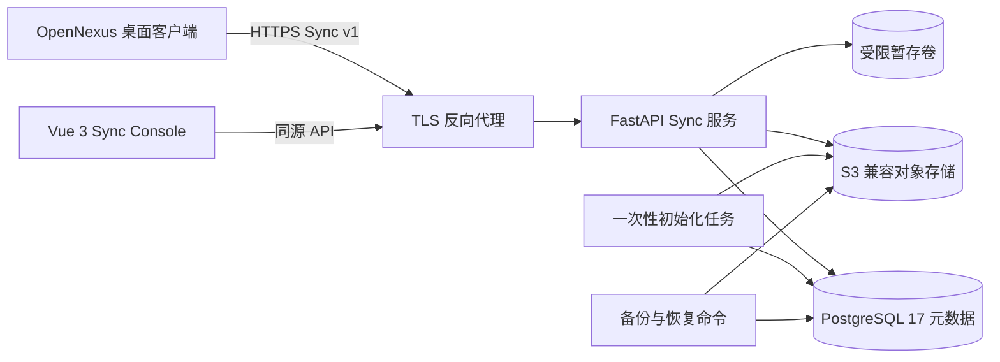
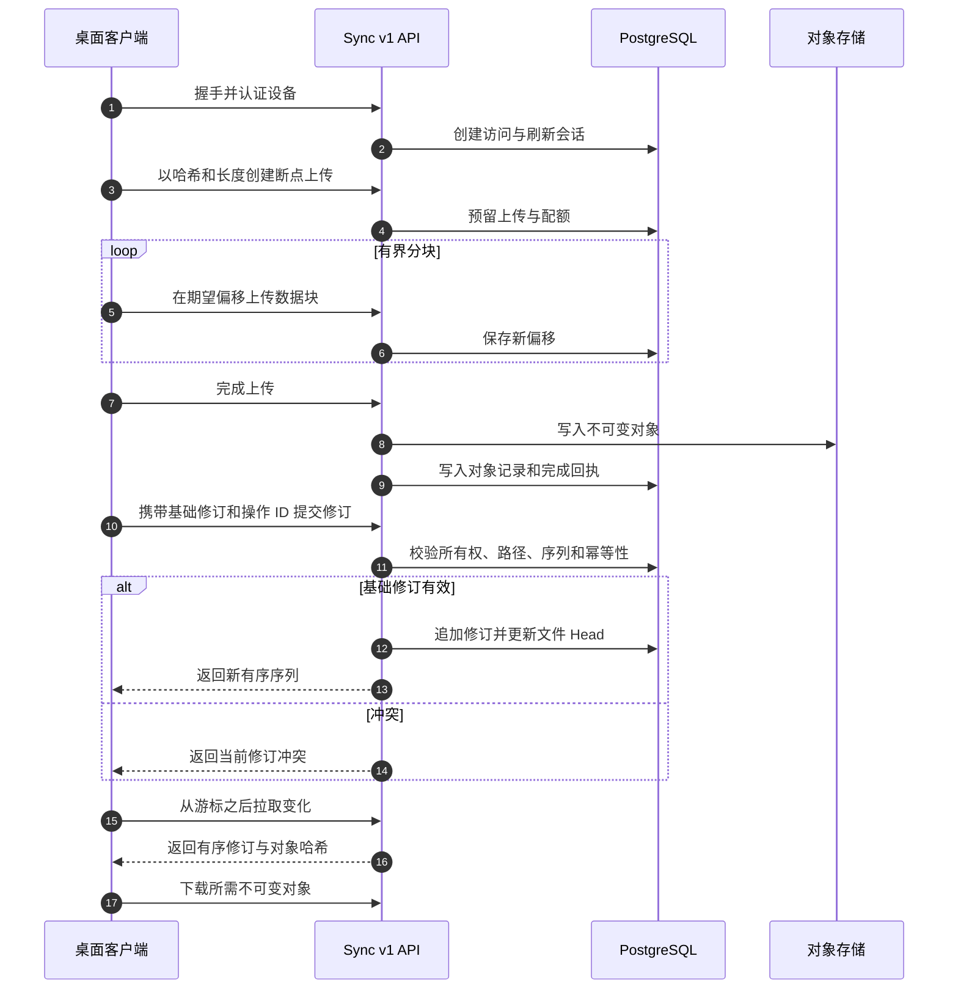
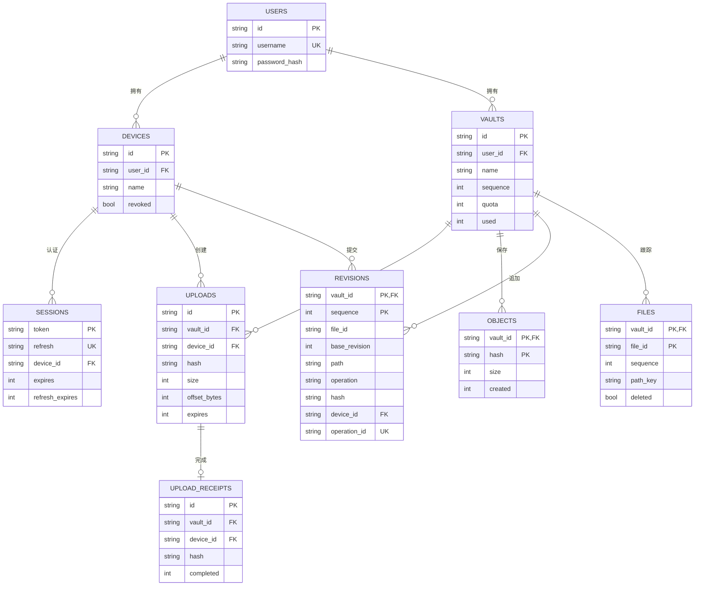
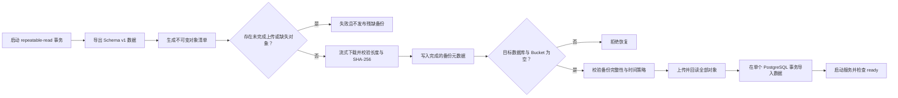

# Sync for OpenNexus

**简体中文** | [English](README.md)

[](https://github.com/KiriAky107/Sync-for-OpenNexus/releases/tag/v0.5.2-alpha1)


[](LICENSE)

Sync for OpenNexus 是 OpenNexus 的可选自托管同步服务，管理账户、设备、不可变内容对象、有序文件修订、断点续传、备份及空实例恢复。它不运行桌面 AI Core，也不会直接读取用户本地 Vault。

> **Alpha 状态：**生产部署必须使用 TLS 和访问控制。PostgreSQL 与 S3 兼容对象存储是生产路径；SQLite 和明文 HTTP 仅用于隔离测试。

## 能力与边界

- Access/Refresh 会话和设备撤销。
- 用户级 Vault 隔离、配额和有序修订流。
- 校验偏移、长度、SHA-256 和幂等完成回执的分块上传。
- PostgreSQL 元数据与不可变对象存储分离。
- 供桌面 Outbox/Inbox 客户端使用的基础修订与冲突检测。
- Repeatable-read 备份和只面向空部署的验证恢复。
- 同源 Vue 控制台，用于健康状态、账户、Vault 和设备管理。

服务不执行模型、不索引 Markdown、不安装扩展，也不接收 OpenNexus 模型提供商凭据，更不会复用 Community Token。

## 系统架构



`compose.yaml` 默认只绑定 `127.0.0.1:8080`，使用幂等初始化任务、只读服务文件系统、删除 Linux Capabilities，并让长期运行服务使用 Bucket 级凭据而非 MinIO Root 凭据。

## 同步协议流程



## 数据库关系



Schema 还包含 `schema_version`、`login_limits` 和 `bootstrap_state`。对象内容位于 S3，PostgreSQL 是所有权、修订顺序、配额、回执和对象目录的权威来源。

## 仓库结构

| 路径 | 用途 |
| --- | --- |
| `sync_server/` | API、协议、数据库、存储、就绪检查、备份与恢复 |
| `console/` | Vue 3 + TypeScript 管理控制台 |
| `tests/` | 协议、生产存储、就绪状态、控制台和基准测试 |
| `tools/` | 有界上传与传输探针 |
| `compose.yaml` | PostgreSQL、MinIO、初始化任务和加固服务 |
| `compose.test.yaml` | 显式隔离测试覆盖配置 |

## 快速部署

```powershell
Copy-Item .env.example .env
# 为所有空白密钥生成彼此独立的值并编辑 .env
docker compose up -d --build
docker compose ps
docker compose logs sync
```

全新数据库会生成临时 `admin`，并向 Sync 容器日志写入 `SYNC_BOOTSTRAP_CREDENTIALS`。首次登录后必须立即修改用户名和密码；在固定凭据前，每次重启都会轮换临时密码并撤销旧会话。

| 环境变量 | 用途 |
| --- | --- |
| `POSTGRES_PASSWORD` | PostgreSQL 容器密码 |
| `SYNC_DATABASE_URL` | 密码经过 URL 编码的 PostgreSQL SQLAlchemy URL |
| `MINIO_ROOT_USER`、`MINIO_ROOT_PASSWORD` | 仅供初始化任务管理对象存储 |
| `SYNC_ACCESS_KEY_ID`、`SYNC_SECRET_ACCESS_KEY` | Bucket 级运行身份 |
| `SYNC_S3_BUCKET` | 已有或初始化的对象 Bucket |
| `SYNC_BIND_ADDRESS`、`SYNC_PORT` | 宿主监听地址与端口 |

不得复用 MinIO Root 凭据作为运行时凭据，升级时必须保持 Bucket 名称一致。

## 健康与运维

- `/health` 报告进程健康。
- `/ready` 检查数据库 Schema、暂存目录写入及对象存储探针。
- `/` 与 `/console/` 提供同源管理控制台。
- 生产流量必须在反向代理终止 TLS；可参考 `Caddyfile.example`。
- `compose.test.yaml` 直接暴露端口的方式仅用于已授权隔离演示。

## 备份与空实例恢复

```powershell
python -m sync_server backup --directory D:/OpenNexus-backups/latest --io-workers 8
python -m sync_server restore --directory D:/OpenNexus-backups/latest --io-workers 8
```



备份包含认证和会话哈希，必须使用受限 ACL、加密存储、保留规则和异机副本保护，并定期在独立空实例演练恢复。

## 开发与测试

```powershell
uv sync --frozen
uv run pytest

cd console
corepack enable
corepack prepare pnpm@10.28.0 --activate
pnpm install --frozen-lockfile
pnpm type-check
pnpm build
```

测试只能使用临时数据库、对象目录和暂存目录，不得读取 OpenNexus 用户 Vault 或真实部署凭据。

## 安全与社区

- 不得提交 `.env`、Token、密码、数据库、对象内容、备份或用户 Vault。
- 限制数据库和对象存储网络，启用监控，并及时撤销遗失设备。
- 路径规范化、操作 ID、基础修订、配额、内容哈希和账户边界均属于安全控制。
- 漏洞按照 [SECURITY.md](SECURITY.md) 私下报告。
- 贡献遵循[贡献指南](CONTRIBUTING.md)和[社区行为准则](CODE_OF_CONDUCT.md)。
- 使用仓库 Issue 表单和 PR 模板，并对基础设施与账户信息脱敏。

相关仓库：[OpenNexus](https://github.com/KiriAky107/OpenNexus) 与 [Community for OpenNexus](https://github.com/KiriAky107/Community-for-OpenNexus)。

## 许可证

本项目采用 [MIT License](LICENSE)，第三方组件继续适用各自的许可证与声明。
