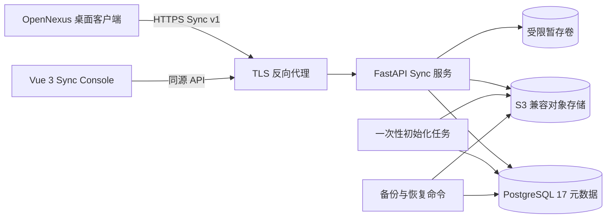
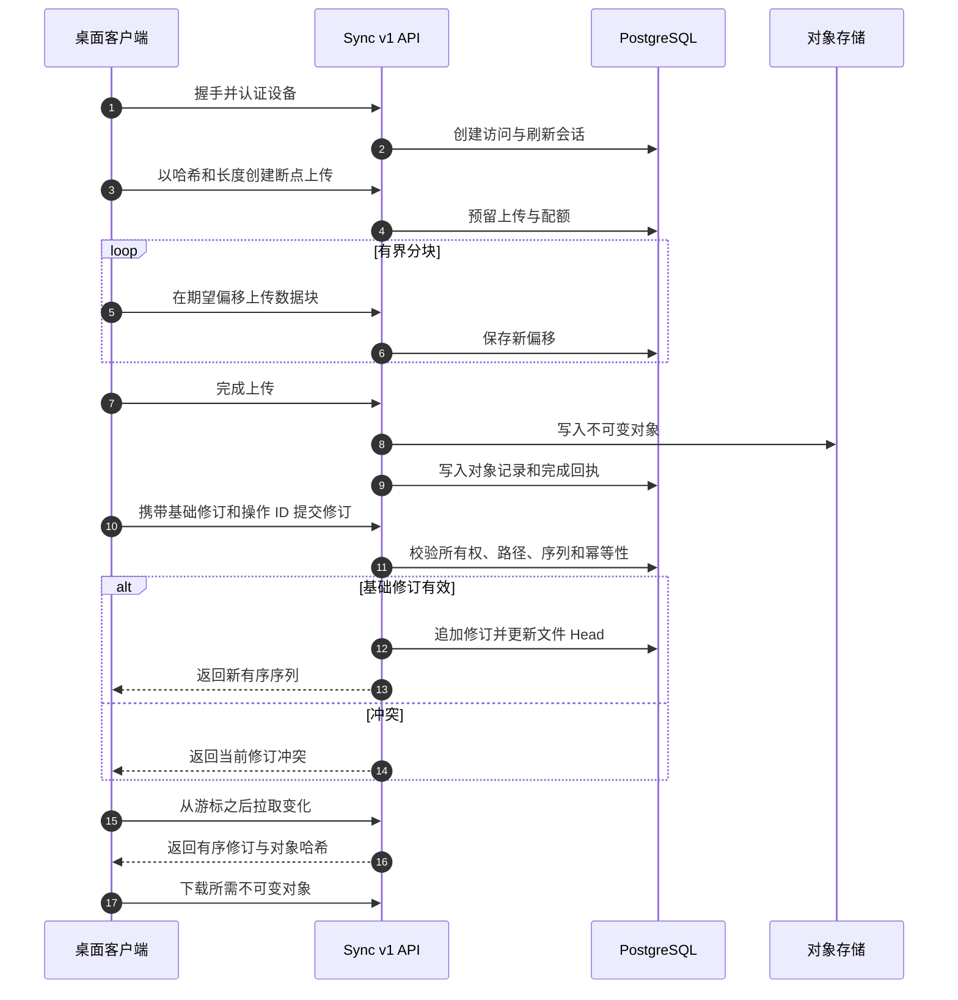
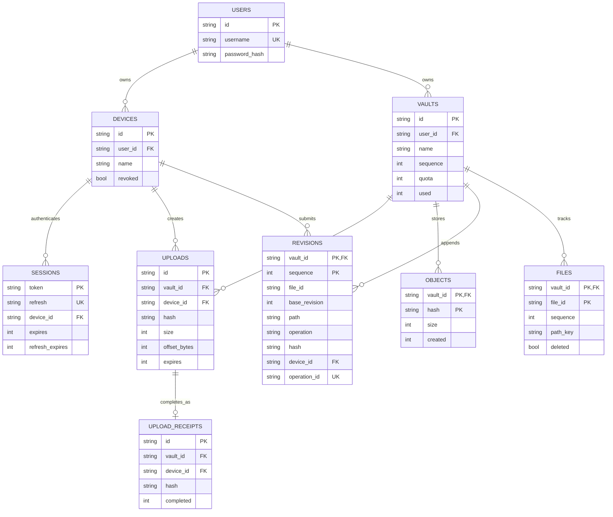
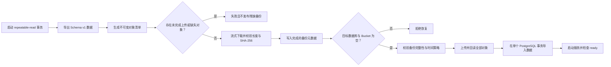

<div align="center">

  

  <h1>Sync for OpenNexus</h1>

  <p><strong>自托管的知识库同步服务</strong></p>

  <p>在自己的基础设施上同步 OpenNexus 知识库，保留文件修订，并在需要时恢复数据。</p>

  <p>
    <a href="README.md">English</a> • <a href="#快速开始">快速开始</a> • <a href="#核心亮点">核心亮点</a> • <a href="#系统架构">系统架构</a> • <a href="#本地开发">本地开发</a> • <a href="https://github.com/KiriAky107/Sync-for-OpenNexus/releases">发布日志</a>
  </p>

  <p>
    <a href="https://github.com/KiriAky107/Sync-for-OpenNexus/releases/tag/v0.6.0"></a> <a href="https://github.com/KiriAky107/Sync-for-OpenNexus/actions/workflows/ci.yml"></a>      <a href="LICENSE"></a>
  </p>

</div>

---

当前版本： [v0.6.0](https://github.com/KiriAky107/Sync-for-OpenNexus/releases/tag/v0.6.0)。

## 0.6.0 更新

- 固定实验源文件、输入及成果的同步类型与能力声明，配套 OpenNexus 0.6.0。
- 提供设备与用量查询、可信进度及冲突回执，保持分块续传、摘要校验和幂等完成。
- 管理控制台支持账户隔离、就绪检查和持久操作记录；CLI 可核对并恢复未知操作结果。
- PostgreSQL 与 S3 部署提供完整备份校验和空目标恢复，逐字核对数据库、对象和设备撤销状态。
- GitHub CI 验证协议、控制台及部署包，发布固定源码、部署归档和 SHA-256 清单。

## 核心亮点

- **设备与会话**：桌面客户端使用 Access/Refresh 会话接入，可在控制台撤销遗失设备。
- **可移植知识库文件**：笔记、附件、实验源码与输入通过稳定文件身份和规范相对路径传输。
- **断点续传**：从已确认的分块偏移继续上传，完成后先校验长度和 SHA-256，再提交文件修订。
- **保留历史**：保存有序修订和不可变对象，以基础修订检查发现并发编辑，避免静默替换内容。
- **用量与隔离**：各账户的知识库分别管理，配额按对象账目和上传预留空间执行。
- **恢复与运维**：校验备份、恢复到空实例，并通过 CLI 或同源 Vue 控制台查看持久操作记录。

## 快速开始

使用 TLS 反向代理、PostgreSQL 元数据和 S3 兼容对象存储部署。Compose 默认将 API 绑定到 `127.0.0.1:8080`。

```powershell
Copy-Item .env.example .env
# 为所有空白密钥生成彼此独立的值并编辑 .env
docker compose up -d --build
docker compose ps
docker compose logs sync
```

全新数据库会生成临时 `admin`，并向 Sync 容器日志写入 `SYNC_BOOTSTRAP_CREDENTIALS`。首次登录后必须立即修改用户名和密码；在固定凭据前，每次重启都会轮换临时密码并撤销旧会话。

| 环境变量 | 用途 |
| --- | --- |
| `POSTGRES_PASSWORD` | PostgreSQL 容器密码 |
| `SYNC_DATABASE_URL` | 密码经过 URL 编码的 PostgreSQL SQLAlchemy URL |
| `MINIO_ROOT_USER`、`MINIO_ROOT_PASSWORD` | 仅供初始化任务管理对象存储 |
| `SYNC_ACCESS_KEY_ID`、`SYNC_SECRET_ACCESS_KEY` | Bucket 级运行身份 |
| `SYNC_S3_BUCKET` | 已有或初始化的对象 Bucket |
| `SYNC_BIND_ADDRESS`、`SYNC_PORT` | 宿主监听地址与端口 |

不得复用 MinIO Root 凭据作为运行时凭据，升级时必须保持 Bucket 名称一致。

通过反向代理访问 `/console/`，登录后固定初始凭据并创建远端知识库。SQLite 和明文 HTTP 测试实例用于隔离验收。

## 核心工作流

### 1. 连接并同步知识库

1. 登录控制台并创建远端知识库，配置其他设备时使用同一知识库身份。
2. 在 OpenNexus 中配置 Sync 服务地址、账户和远端知识库。每台设备使用独立会话，模型提供商凭据与 Sync 凭据分别管理。
3. 执行同步、查看进度，并在选择保留内容前审核冲突。文件改名保留稳定身份，服务不会执行上传的文件。

### 2. 管理设备访问

在控制台设备列表中撤销选定会话，该设备的下一次认证请求即会失败。知识库文件与历史修订仍供其他授权设备访问。

### 3. 恢复前校验备份

先创建备份、运行 `verify-backup` 并核对保存的回执。仅向空数据库和空对象桶恢复，之后检查 `/ready`，再连接测试设备。命令和未知结果处理见[备份与恢复](#备份与恢复)。

## 系统架构


```mermaid
flowchart LR
    Desktop[OpenNexus 桌面客户端] -->|HTTPS Sync v1| Proxy[TLS 反向代理]
    Console[Vue 3 Sync Console] -->|同源 API| Proxy
    Proxy --> API[FastAPI Sync 服务]
    API --> PG[(PostgreSQL 17 元数据)]
    API --> Stage[(受限暂存卷)]
    API --> S3[(S3 兼容对象存储)]
    Init[一次性初始化任务] --> PG
    Init --> S3
    Backup[备份与恢复命令] --> PG
    Backup --> S3
```

`compose.yaml` 默认只绑定 `127.0.0.1:8080`，使用幂等初始化任务、只读服务文件系统、删除 Linux Capabilities，并让长期运行服务使用 Bucket 级凭据而非 MinIO Root 凭据。

对象服务通过 `Dockerfile.objects` 从 [MinIO 官方安全修复版本](https://github.com/minio/minio/releases/tag/RELEASE.2025-10-15T17-29-55Z) 构建，固定源码提交并检查归档 SHA-256，不依赖已无法拉取的公共容器镜像，数据仍保存在既有 `/data` 卷。GitHub CI 使用同一构建文件，验证备份、数据库全部行的逐字恢复、对象哈希、恢复后的设备撤销及非空目标拒绝；上传产物只包含脱敏结果。

## 同步协议流程


```mermaid
sequenceDiagram
    autonumber
    participant Client as 桌面客户端
    participant API as Sync v1 API
    participant DB as PostgreSQL
    participant Obj as 对象存储

    Client->>API: 握手并认证设备
    API->>DB: 创建访问与刷新会话
    Client->>API: 以哈希和长度创建断点上传
    API->>DB: 预留上传与配额
    loop 有界分块
        Client->>API: 在期望偏移上传数据块
        API->>DB: 保存新偏移
    end
    Client->>API: 完成上传
    API->>Obj: 写入不可变对象
    API->>DB: 写入对象记录和完成回执
    Client->>API: 携带基础修订和操作 ID 提交修订
    API->>DB: 校验所有权、路径、序列和幂等性
    alt 基础修订有效
        API->>DB: 追加修订并更新文件 Head
        API-->>Client: 返回新有序序列
    else 冲突
        API-->>Client: 返回当前修订冲突
    end
    Client->>API: 从游标之后拉取变化
    API-->>Client: 返回有序修订与对象哈希
    Client->>API: 下载所需不可变对象
```

## 数据库关系


```mermaid
erDiagram
    USERS ||--o{ DEVICES : owns
    DEVICES ||--o{ SESSIONS : authenticates
    USERS ||--o{ VAULTS : owns
    VAULTS ||--o{ UPLOADS : stages
    DEVICES ||--o{ UPLOADS : creates
    VAULTS ||--o{ OBJECTS : stores
    VAULTS ||--o{ REVISIONS : appends
    DEVICES ||--o{ REVISIONS : submits
    VAULTS ||--o{ FILES : tracks
    UPLOADS ||--o| UPLOAD_RECEIPTS : completes_as

    USERS {
        string id PK
        string username UK
        string password_hash
    }
    DEVICES {
        string id PK
        string user_id FK
        string name
        bool revoked
    }
    SESSIONS {
        string token PK
        string refresh UK
        string device_id FK
        int expires
        int refresh_expires
    }
    VAULTS {
        string id PK
        string user_id FK
        string name
        int sequence
        int quota
        int used
    }
    UPLOADS {
        string id PK
        string vault_id FK
        string device_id FK
        string hash
        int size
        int offset_bytes
        int expires
    }
    OBJECTS {
        string vault_id PK, FK
        string hash PK
        int size
        int created
    }
    REVISIONS {
        string vault_id PK, FK
        int sequence PK
        string file_id
        int base_revision
        string path
        string operation
        string hash
        string device_id FK
        string operation_id UK
    }
    FILES {
        string vault_id PK, FK
        string file_id PK
        int sequence
        string path_key
        bool deleted
    }
    UPLOAD_RECEIPTS {
        string id PK
        string vault_id FK
        string device_id FK
        string hash
        int completed
    }
```

Schema 还包含 `schema_version`、`login_limits`、`bootstrap_state` 和 `revision_annotations`。附加记录保存已知修订时间与恢复来源；旧修订缺少这些证据时，时间保持未知。对象内容位于 S3，PostgreSQL 是所有权、修订顺序、配额、回执和对象目录的权威来源。

### 不透明文件内容与实验文件兼容

握手声明 `encryption: transport-only`。部署时使用 HTTPS / TLS；服务仍可读取对象内容及文件路径，传输加密不是端到端加密。新增的 `features` 声明标识已有的 SHA-256 对象、稳定文件身份、规范路径和已确认偏移续传契约。同步不会执行接收的文件；只使用原有 v1 字段的客户端可以继续忽略此声明。

Sync API v1 将对象内容作为不透明字节传输，校验规范相对路径、内容摘要、对象大小和修订所有权。历史预览另外解码大小受限的文本和图片，服务始终不执行文件。OpenNexus 桌面客户端可沿用现有修订与对象协议同步知识库根目录 `experiments/` 下的 `.py` 源码以及 `.json`、`.csv` 输入数据，无需新增 API 版本。桌面端负责限制哪些本地文件类型进入同步；不认识这些扩展名的旧客户端会忽略它们，不会运行文件。

## 仓库结构

| 路径 | 用途 |
| --- | --- |
| `sync_server/` | API、协议、数据库、存储、就绪检查、备份与恢复 |
| `console/` | Vue 3 + TypeScript 管理控制台 |
| `tests/` | 协议、生产存储、就绪状态、控制台和基准测试 |
| `tools/` | 有界上传与传输探针 |
| `compose.yaml` | PostgreSQL、MinIO、初始化任务和加固服务 |
| `compose.test.yaml` | 显式隔离测试覆盖配置 |

## 生态项目

| 仓库 | 职责 |
| --- | --- |
| [OpenNexus](https://github.com/KiriAky107/OpenNexus) | 本地知识库编辑、AI 工作流与经过审核的扩展安装 |
| [Sync for OpenNexus](https://github.com/KiriAky107/Sync-for-OpenNexus) | 可选的自托管知识库同步与恢复 |
| [Community for OpenNexus](https://github.com/KiriAky107/Community-for-OpenNexus) | 独立签名扩展目录与发布审核 |

服务按需启用、分别部署。Sync 使用 `/sync/v1`，Community 使用 `/catalog/v1`；产品版本和协议版本分别维护。

## 健康与运维

- `/health` 报告进程健康。
- `/ready` 检查数据库 Schema、暂存目录写入及对象存储探针。
- `/` 与 `/console/` 提供同源管理控制台。
- 生产流量必须在反向代理终止 TLS；可参考 `Caddyfile.example`。
- `compose.test.yaml` 直接暴露端口的方式仅用于已授权隔离演示。

## 备份与恢复

```powershell
python -m sync_server backup --directory D:/OpenNexus-backups/latest --io-workers 8
python -m sync_server verify-backup --directory D:/OpenNexus-backups/latest --io-workers 8
python -m sync_server restore --directory D:/OpenNexus-backups/latest --io-workers 8
python -m sync_server operation-records --limit 20
```

`verify-backup` 校验数据库快照、每个对象及恢复使用的时间策略，无需连接 PostgreSQL 或 S3。`--max-age-hours` 默认 24 小时。备份、校验和恢复会先保存操作意图，再持久保存结果；记录路径由 `SYNC_OPERATIONS_PATH` 指定。容器部署使用独立 `operations` 卷，独立运行时应设置持久路径。记录只包含操作 ID、时间、固定错误码和计数。未完成记录表示没有保存完成回执，重试前应核对原进程及目标数据。

使用 `python -m sync_server operator-id --username <已固定账户名>` 获取账户的稳定 `user_id`，将获准账户 ID 填入部署配置 `SYNC_OPERATOR_USER_IDS`，多个 ID 用逗号分隔，再重启服务，即可在控制台查看分页运维记录。账户改名后权限保持，设备撤销和会话过期仍会阻止访问。默认不开放记录查看权限。控制台提供只读记录和依赖故障提示；CLI 可用 `operation-records --before <next_before>` 查看更早记录。恢复仍要求数据库和对象桶为空。


```mermaid
flowchart LR
    A[启动 repeatable-read 事务] --> B[导出 Schema v1 数据]
    B --> C[生成不可变对象清单]
    C --> D{存在未完成上传或缺失对象？}
    D -- 是 --> X[失败且不发布残缺备份]
    D -- 否 --> E[流式下载并校验长度与 SHA-256]
    E --> F[写入完成的备份元数据]
    F --> G{目标数据库与 Bucket 为空？}
    G -- 否 --> Y[拒绝恢复]
    G -- 是 --> H[校验备份完整性与时间策略]
    H --> I[上传并回读全部对象]
    I --> J[在单个 PostgreSQL 事务导入数据]
    J --> K[启动服务并检查 ready]
```

备份包含认证和会话哈希，必须使用受限 ACL、加密存储、保留规则和异机副本保护，并定期在独立空实例演练恢复。

## 本地开发

```powershell
uv sync --frozen
uv run pytest

cd console
corepack enable
corepack prepare pnpm@10.28.0 --activate
pnpm install --frozen-lockfile
pnpm type-check
pnpm build
```

测试只能使用临时数据库、对象目录和暂存目录，不得读取 OpenNexus 用户 Vault 或真实部署凭据。

## 安全与参与贡献

- 不得提交 `.env`、Token、密码、数据库、对象内容、备份或用户 Vault。
- 限制数据库和对象存储网络，启用监控，并及时撤销遗失设备。
- 路径规范化、操作 ID、基础修订、配额、内容哈希和账户边界均属于安全控制。
- 漏洞按照 [SECURITY.md](SECURITY.md) 私下报告。
- 贡献遵循[贡献指南](CONTRIBUTING.md)和[社区行为准则](CODE_OF_CONDUCT.md)。
- 使用仓库 Issue 表单和 PR 模板，并对基础设施与账户信息脱敏。

## 开源协议

本项目采用 [MIT License](LICENSE)，第三方组件继续适用各自的许可证与声明。
